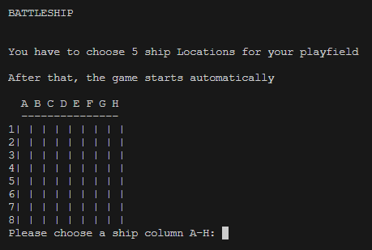
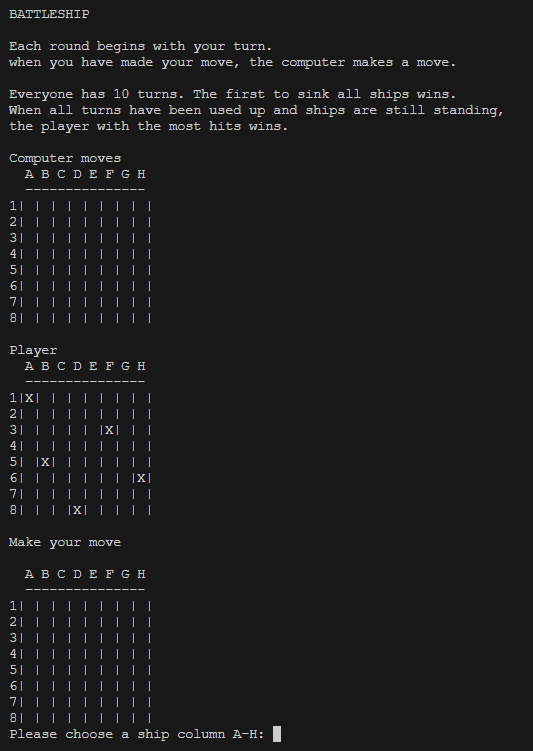
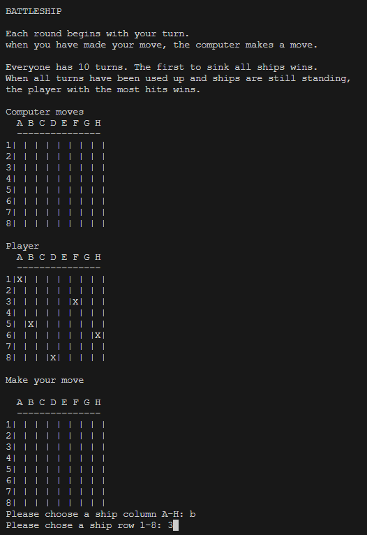
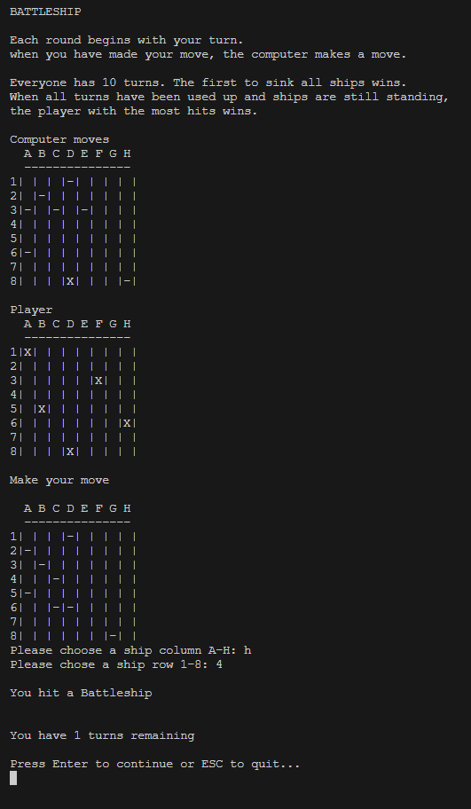
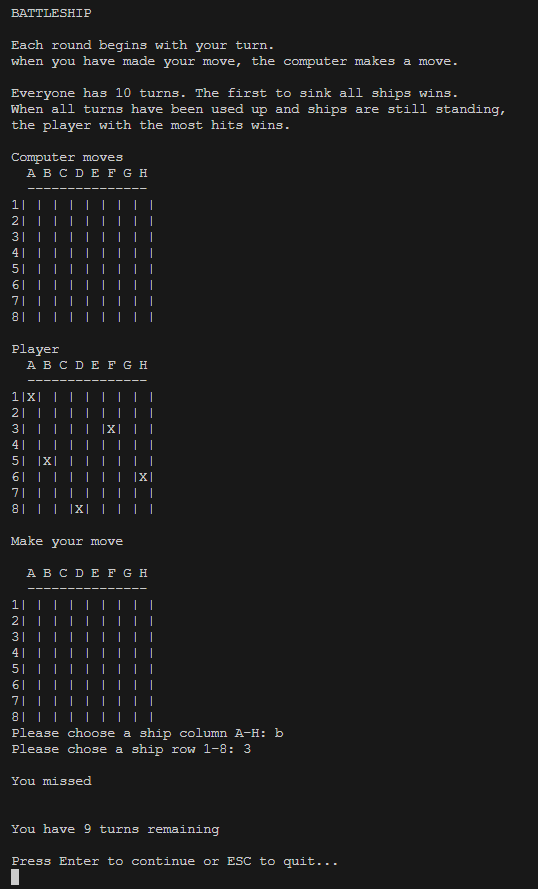
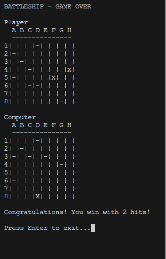
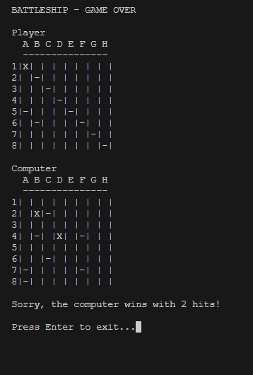
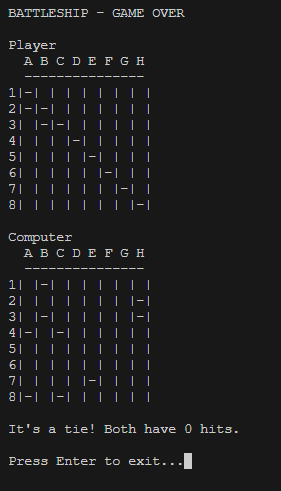

# Code-Institute-Projekt-3-PYTHON-battleship

# Portfolio Project 3 Python. A simple battleships game

 ## Contents

* [User Experience (UX)](#User-Experience-(UX))
    * [Initial Discussion](#Initial-Discussion)
    * [Client Goals](#Client-Goals)

* [Design](#Design)

  * [Wireframes](#Wireframes)
  * [Features](#Features)
  * [Accessibility](#Accessibility)
  * [Technologies Used](#Technologies-Used)
  * [Languages Used](#Languages-Used)
  * [Frameworks, Libraries & Programs Used](#Frameworks,-Libraries-&-Programs-Used)

* [Deployment & Local Development](#Deployment-&-Local-Development)
  * [Deployment](#Deployment)
  * [Local Development](#Local-Development)
    * [How to Fork](#How-to-Fork)
    * [How to Clone](#How-to-Clone)

* [Testing](#Testing)
    
* [Credits](#Credits)
  * [Code Used](#Code-Used)
  * [Content](#Content)
  * [Media](#Media)
  * [Acknowledgments](#Acknowledgments)

  ## User Experience (UX)

### Initial discussion
In project 3 I programmed a game called "Battleship".
The game is a simple PVE game. The player and the computer have 10 moves to win the game. The winner is the one who either hits all enemy ships or has the higher score at the end.

### User stories

#### Client goals

* The user should be able to play the game without any prior knowledge of the game

#### First-time visitor goals
* I want to find out how the game works
* I want to win against the computer
* I want to be able to exit the game when I don't want to play anymore

#### Returning Visitor Goals
* I want to win against the computer
* I want to be able to exit the game when I don't want to play anymore

---

## Design

The game was programmed in Python to use the terminal. Since the game is text-based, it has no real design

### Features

* Game Start, Player has to place 5 ships. A small instruction of what to do is shown.  

* After placing all five ships, there is a description of the game. The game starts automatically.
* At first, the player has to choose a column A-H  

* then the player has to choose a row 1-8  

* If the player hits a computer ship, it will be pointed out with a hit message.  

* If the player misses a computer ship it shows the miss message.  

* If the player wins the game, the game shows the "You win" message as shown in the image below:  

* If the player loses the game, the game shows the "You loose" message:  

* Sometimes, the player and computer both have the same amount of hits  and the game shows a "Tie" message.  

* After win, loss or tie, the game ends.

---

#### Game Mechanics

* The game allows the player to place their ships on the game board.
* The player can make guesses to target the computer's ships.
* The computer also makes guesses to target the player's ships.
* The game keeps track of the remaining turns for both the player and the computer.
* The game ends when one player sinks all the opponent's ships or when the turns run out.
#### User Interface
* The game is played in the terminal, providing a simple and text-based user interface.
* The player is shown their board with their placed ships and their guesses.
* The player can see the computer's board to track their hits and misses.
#### Interaction
* The player can interact with the game by inputting coordinates for their guesses and ship placements.
* The game provides clear messages for hits, misses, and game outcomes.
* The player can exit the game after each round by typing "exit".

#### Accessibility

* The game's text-based interface ensures a basic level of accessibility.

---

#### Technologies Used

* Python: The programming language used to build the game logic.
* msvcrt library: Used to handle keyboard input for a better user experience in the terminal.

#### Languages Used

* Python: The main language used for programming the game.

#### Frameworks, Libraries & Programs Used

* Visual Studio Code: The code editor used for development.
* Git & GitHub: Used for version control and project collaboration.
* Github - To save and store the files.
* Heroku for final deployment.

### Deployment & Local Development

#### Deployment

The game is designed to be played locally in a terminal environment. It can be run by executing the Python script my_battleships.py.  

The third project was developed through Gitpod, using the template provided by Code Institute. Every step was documented and pushed thoroughly via GitHub.

#### Github
1. Login (or sign up) to Github.
2. Find the repository for this project, Code-Institute-Projekt-3-PYTHON-battleship.
3. Click on the Settings link.
4. Click on the Pages link in the left-hand side navigation bar.
5. In the Source section, choose main from the drop-down select branch menu. Select Root from the drop-down select folder menu.
6. Click Save. Your live Github Pages site is now deployed at the URL shown.cal machine.

#### Heroku

The deployment is made using [Heroku](https://www.heroku.com/) following the listed steps:

1. Log in or register a new account on Heroku
2. Click on 'New' in the dashboard and select 'Create New App'
3. Select a name for the app and choose your region.
4. Click on "Create app"
5. When the app is created click on Setting
6. To improve compatibility with various Python libraries add Config Var with Key = PORT and the Value = 8000
7. Add 2 buildpacks: Python and then Nodejs in this specific order 
8. Go back at the top and click on "Deploy" and select "GitHub"
9. Scroll down and click on 'Connect to GitHub'
10. Search for your GitHub repository name by typing it
11. Click on "Connect"
12. Scroll down and click on "Deploy Branch"
13. You will see a message "The app was successfully deployed" when the app is built with python and all the depencencies
14. Click on view and you will see the deployed site

#### Local Development

##### How to Clone

To clone the Code-Institute-Projekt-2-CSS-HTML-JavaScript repository:

1. Login (or sign up) to GitHub.
2. Go to the repository for this project, MrHaJu/Code-Institute-Projekt-3-PYTHON-battleship.
3. Click on the code button, select whether you would like to clone with HTTPS, SSH, or GitHub CLI, and copy the link shown.
4. Open the terminal in your code editor and change the current working directory to the location you want to use for the cloned directory.
5. Type 'git clone' into the terminal and then paste the link you copied in step 3. Press enter.

- - -

## **Testing**

Please view the [testing.md](testing.md) file for more information on the testing undertaken.

- - -

## Credits

#### Code Used

* [Code from Bito VSC extension to find Bugs and Explain how code works](https://marketplace.visualstudio.com/items?itemName=Bito.Bito)
* [Tutorial By KnowledgeMavens used as a Base for the Game](https://www.youtube.com/watch?v=tF1WRCrd_HQ)
* [W3 schools to find ways to solve problems and improve the code](https://www.w3schools.com/)

#### Content

* The README template was adapted from the Code Institute README template.
* The game logic and structure were developed by (Andreas Huppertz).

#### Media

* No media is used in this text-based game.

### Acknowledgments

* Special thanks to [Jubril Akolade](https://github.com/Jubrillionaire) for providing guidance and support during the development of this project.
* [KnowledgeMavens Channel](https://www.youtube.com/@KnowledgeMavens)
* [Bito VSC extension](https://marketplace.visualstudio.com/items?itemName=Bito.Bito)