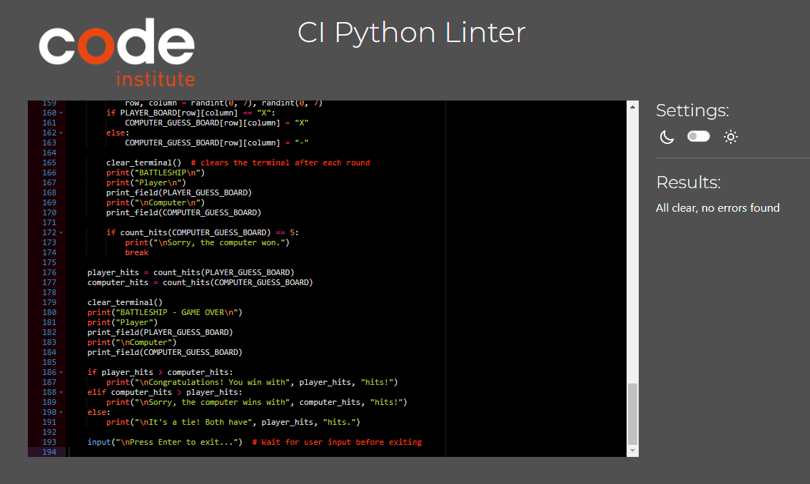

# Code-Institute-Projekt-3-PYTHON-battleship
 
 ## Portfolio Project 3 Python. A simple battleships game

## Contents

* [AUTOMATED TESTING](#automated-testing)
    * [CI Python Linter](#CI-Python-Linter)
    * [Grammarly](#Grammarly)
    

* [MANUAL TESTING](#manual-testing)
    * [Full Testing](#full-testing)
    * [User Stories](#user-stories)
    * [Browser Testing](#browser-testing)

* [BUGS](#bugs)
    * [Known Bugs](#known-bugs)
    * [Solved Bugs](#solved-bugs)

---

### CI Python Linter

### Grammarly

[Grammarly](https://www.grammarly.com/grammar-check) was used to prevent spelling mistakes

---

## MANUAL TESTING

### Solved Bugs

| Bug No | Bug Issue | How Resolved |
| :--- | :--- | :--- |
| 1 | Computer ships placed on already occupied fields | Implemented a check to ensure that computer ships are not placed on already occupied fields |
| 2 | Incorrect selection of ship coordinates by the player |  Implemented a validation to ensure that the player cannot select already occupied coordinates for ship placement |
| 3 | Incorrect hit-and-miss validation | Updated the hit-and-miss validation to prevent a player from shooting at the same field twice and to display the correct messages |
| 4 | If space is entered the game is aborted | inserted String Strip() Method to remove spaces and trailing whitespaces |
| 5 | If only Enter was pressed, the game is aborted | If loop with KeyError inserted |

### Known Bugs

| Known Bug No | Bug Issue | Plan to Resolve |
| :--- | :--- | :--- |
|  |  |  |

- - -

### Full Testing

Full testing was performed on Visual Studio Code Terminal

| Feature                  | Expected Outcome                            | Testing Performed                                   | Result                    | Pass/Fail |
| ------------------------ | ------------------------------------------ | --------------------------------------------------- | ------------------------- | --------- |
| Initial Ship Placement   | Computer and player ships placed correctly | Manually placed ships and checked the game board    | Ships placed correctly    | Pass      |
| Invalid Ship Placement   | Ships can't be placed on occupied spots    | Attempted to place ships on occupied spots         | Ships not placed          | Pass      |
| Player Turn - Hit        | Player hits a computer ship                | Chose a computer ship location for player's guess  | Hit confirmed             | Pass      |
| Player Turn - Miss       | Player misses a computer ship              | Chose a location with no ship for player's guess   | Miss confirmed            | Pass      |
| Player Turn - Repeated   | Player repeats a guess                     | Guessed the same location twice in a row           | Repeated guess rejected   | Pass      |
| Computer Turn - Hit      | Computer hits a player ship                |  on player's ship       | Hit confirmed             | Pass      |
| Computer Turn - Miss     | Computer misses a player ship              |  miss by computer on player's guess     | Miss confirmed            | Pass      |
| Player Wins              | Player sinks all computer ships            | Player hits all computer ship locations            | Player wins               | Pass      |
| Computer Wins            | Computer sinks all player ships            | Computer hits all player ship locations            | Computer wins             | Pass      |
| Tie Game                 | Both players have same hits                | Equal hits by player and computer                   | Game ends in a tie        | Pass      |
| Max Turns Reached        | Both players haven't won within turns limit | Reached maximum turns without decisive outcome    | Game ends in a tie | Pass      |

---

Back to [README.md](README.md)